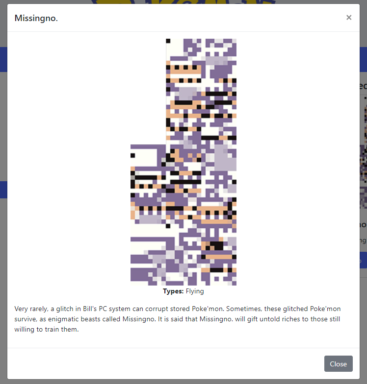

THIS WAS MY UNIVERSITY ASSIGNMENT TO CREATE A FUNCTIONAL POKEMON WEBSITE

# COMPSCI 719 Assignment One &ndash; Server-Side Pokémon
This assignment has several tasks, which will initially see you building the *server-side* functionality for the client app you wrote in Assignment 01 (see the below screenshot for reference).


Following this, you will write completely new functionality - an *admin* page which allows users to browse a table of all Pokémon in the system, and add new ones using an HTML form.

This assignment is marked out of **45 marks** and is worth **10%** of your final grade for the course.

You are given a skeleton project containing several complete or partially complete files. You will complete the assignment by completing the implementation of several existing files, as well as adding your own.

## Submission instructions
Your latest commit to the `main` branch of your GitHub Classroom repository for this assignment, as of the due date identified on Canvas, will serve as your submission for this assignment. Please also submit the URL to your assignment repository to Canvas, on or before the due date.


## Project structure
This section details the structure of the given starter project, and provides information on the existing files.

### Root folder
This folder contains, amongst other things, the `package.json` file specifying the dependencies for this project. It has already been filled out for you. It also contains the node.js program entry point for the webapp - `assignment-02-webapp.js`. This file, as given, imports and configures the following modules:

- `express`
- `handlebars`
- `body-parser`

The JS file also sets up the `public` folder to be served statically, and contains a single route handler which will render the `server-info` view when a user navigates to the root path (`/`).

### `data` folder
This folder contains two `json` files. These files contain the data used by the webapp. You don't need to interact with either of these files directly.

### `modules` folder
This folder contains several custom node.js *modules*, which will be of use to you during this assignment. You do not need to modify these, nor will you need to add new ones - but it would pay to look at the ones which are there, to gain an understanding of them and how they may be used.

The included modules are:

- `make-array.js`: This module exports a single function, which converts the given input into an array, no matter what it is. This may be useful when handling form submission.

- `multer-uploader.js`: This module configures Multer, and exports an `upload` object which can be used to accept single file uploads.

- `pokemon-db.js`: Through this module, you may interact with the `json` files in the `data` folder. The module exports several functions, example usage of which is given here:

    ```js

    const pokemonDb = require("/path/to/pokemon-db.js");

    // Gets the number of Pokémon stored in the db
    const numPokemon = pokemonDb.getNumPokemon();

    // Gets an array of all Pokémon stored in the db
    const pokemonArray = pokemonDb.getAllPokemon();

    // Gets a single Pokémon with the given id
    const mewtwo = pokemonDb.getPokemonById(150);

    // Gets a single Pokémon with the given array index
    const firstPokemon = pokemonDb.getPokemonByArrayIndex(0);

    // Gets all the type effectiveness data (used to populate the type chart)
    const typeData = pokemonDb.getTypeData();

    // Adds a new Pokémon to the system
    const lugia = {
        id: 249,
        name: "Lugia",
        types: ["Psychic", "Flying"],
        imageUrl: "Lugia.png",
        description: "It is said to be the guardian of the seas. It is rumored to have been seen on the night of a storm."
    };
    pokemonDb.addPokemon(lugia);

    ```

### `public` folder
Contains publically-available files, such as HTML, CSS, and client-side JavaScript files. Most notably, it contains the following:

- `client.html`: This file, along with `js/client.js`, is a model solution to Assignment One, except that the URLs used by its `fetch()`es have been modified to point to *this* webapp itself, rather than `trex-sandwich.com`. When this client functions as indented, this is a good indication that you've completed the first part of the assignment.

- `images/pokemon`: This folder contains all the Pokémon images. Later on, when you allow users to add new Pokémon, the images they upload should be saved here.

### `routes` folder
This folder contains the JavaScript files which will contain your route handlers for the assignment. We are adopting good coding practice and separation of concerns by separating our route handling logic from the main application config (which is still in `assignment-02-webapp.js`), using a combination of Express *routers*, and node.js modules.

The folder currently contains `web-service.js`, in which you will implement your route handlers for the first part of the assignment. You will need to add an additional file to this folder yourself later on.

### `views` folder
Contains the Handlebars views and layouts for this assignment. You will not need to add any new views or layouts, but will need to complete the implementation of `admin.handlebars`.


## Running the existing webapp
To run the existing webapp, do an `npm install` then start the app using `npm start`. You should be able to browse to <http://localhost:3000/>, and see the rendered `server-info` view. This view contains links to other website areas including the *client* and the (not-yet-implemented) *admin* page. It also contains information about the web service which you'll implement in Task One. The links on this page will begin to function as you complete various tasks.


## Task One &ndash; A Pokémon web service (15 marks)
For this task, you'll complete the "web service" portion of the app. Once complete, the client site (`client.html`) will function correctly.

To begin, at the marked location within `assignment-02-webapp.js`, import the `routes/web-service.js` module and add it to the webapp using `app.use()`. Then, within `web-service.js`, add the following three route handlers *(5 marks each)*:

1. `/services/pokemon`: When a client makes a GET request to this route, an `id` should be read from the request's *query*. Using an appropriate `pokemonDb` function (you'll find this module has already been imported), get the Pokémon with the queried `id`. Then, this route should send that Pokémon back to the client, as JSON.

   **Hint:** The `id` read in from the query will be a *string*. You should convert it to a number using the `parseInt()` function, before trying to use it with one of the `pokemonDb` functions.

2. `/services/pokemon/types`: When a client makes a GET request to this route, this handler should get the type effectiveness data using the appropriate `pokemonDb` function. Then, this route should send that data back to the client, as JSON.

3. `/services/pokemon/random`: When a client makes a GET request to this route, this handler should generate a random integer between `0` and the total number of Pokémon stored in `pokemonDb`. The handler should then get the Pokémon with that *array index*, and send it back to the client as JSON.

To test your implementation of these three routes, use a combination of manually navigating to these URLs in the browser (supplying an appropriate query parameter where required), or using the links provided on the webapp's homepage. In addition, the completion of these three route handlers should result in `client.html` operating successfully, with the same behaviour you would have seen on a completed Assignment One submission.


## Task Two &ndash; An admin page (16 marks)
For this task, you'll complete an admin page displaying an HTML table of all Pokémon currently in the system. To do this, complete the following steps:

1. As this functionality is somewhat separate from the Task One functionality, we want to separate it into its own file. As such, begin by creating a new JavaScript file in the `routes` folder. Call it something sensible, such as `admin.js`.

2. *(4 marks)* Within your new JS file, begin by importing necessary modules, creating a new Express Router, and exporting that router so it can be accessed outside of the file (see web-service.js and / or the relevant lab exercises for inspiration). Then, import and add the router to the marked location within `assignment-02-webapp.js`, as you did with `web-service.js` in Task One.

3. *(4 marks)* Now, add a new route handler to your new router. Whenever a client makes a GET request to `/admin`, the route handler should get *all* Pokémon from the `pokemonDb`. It should then pass those Pokémon, inside a `context` object, to the `admin` view for rendering.

4. *(8 marks)* Now, complete the `admin.handlebars` route handler by adding a `<table>` at the marked location. The table should consist of a `<thead>` with a single `<tr>` containing the header `<th>`s. It should also consist of a `<tbody>`, with one `<tr>` per Pokémon. The five columns should be: *Image, ID, Name, Types,* and *Description*. Give the `<table>` both the `table` and `table-striped` CSS classes, and set each ``'s `width` to `64`. The resulting table can be seen in the below screenshot.


## Task Three &ndash; Creating new Pokémon (14 marks)
To complete the webapp, we'll allow admins to add new Pokémon to the system by filling out a form. To add this functionality, perform the following steps:

1. *(2 marks)* Add a new route handler to the router you created in Task Two. Whenever a client makes a GET request to `/newPokemon`, the `new-pokemon-form` view should be rendered. Once this is complete, you should be able to browse to the form using <http://localhost:3000/newPokemon>, or by following the hyperlink on the homepage. The form itself is already complete, and looks as per the following screenshot:


2. *(4 marks)* Investigate the contents of `new-pokemon-form.handlebars`. Then, in your Task Two router file, add an appropriate route handler which will capture a user's form submission. As this form contains a file upload, remember to make appropriate use of the Multer upload object contained within the provided `multer-uploader.js` module.

3. *(3 marks)* Add code to your route handler for step 2, which will move the uploaded image file into the `./public/images/pokemon` folder. The image should also be renamed to its *original* name (i.e. the actual name of the file the user uploaded).

4. *(4 marks)* Add further code to the same route handler, which will create a new Pokémon JSON object and save it to the `pokemonDb`. A Pokémon has an `id`, a `name`, a `types` array, an `imageUrl`, and a `description`. All these values can be obtained from the request `body`, except the `imageUrl` which should simply be the name of the uploaded image file.

   **Hint:** Take a look at the `modules` folder description above, for an example of how to save a Pokémon.

   **Hint 2:** Remember that a Pokémon's `id` needs to be an integer, but the value from the user's form submission will be a string. Therefore, use of `parseInt()` is required.

   **Hint 3:** Remember that the submitted `types` value might be `undefined`, or a string, or an array, depending on the number of checkboxes the user selected. The function contained within the `make-array.js` module can help with this.

   **Hint 4:** `pokemonDb` is set up so it will *throw an error* if you supply it with invalid Pokémon data, rather than save invalid data to the db file. The error message that will be printed to the terminal may help you figure out what your error is.

5. *(1 mark)* Finally, the same route handler should *redirect* the user back to `./admin` - where they should be able to see the newly added Pokémon in the table, sorted by its ID, as can be seen in the screenshot below.


When Task Three is complete and you've added one or more new Pokémon to the system, perform a final test of your webapp by navigating to the client once again (<http://localhost:3000/client.html>). Keep clicking the *Randomize* button - eventually, your newly added Pokémon should show up!




## Resetting the `pokemon.db.json` file
If you've found that you've corrupted the `pokemon-db.json` file, or you wish to reset it back to default, you can delete all of its contents and replace it with the contents of the included `pokemon-db BACKUP.json` file.

If you'd like to use "real" Pokémon data for testing, [Bulbapedia](https://bulbapedia.bulbagarden.net/wiki/Main_Page) is an excellent source for reference material. Otherwise, just feel free to make up your own!